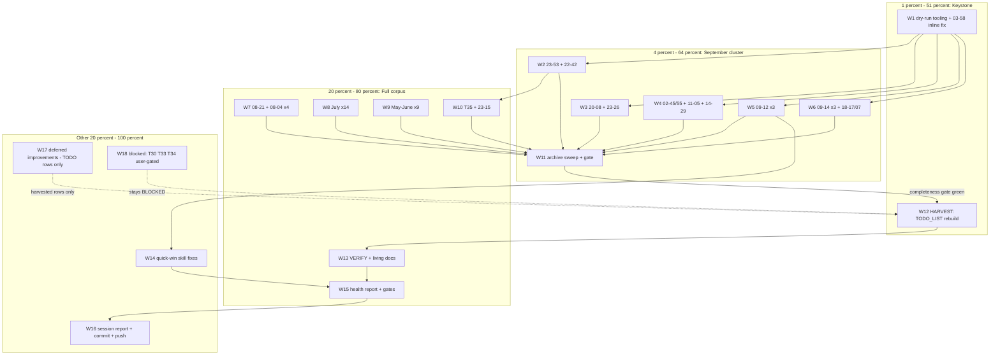

# Docs-Health Full-Audit Completion Plan — Pareto Execution

**Date:** 2026-09-16 18:51 (Wednesday, CEST)
**Plan type:** Point-in-time execution plan (annotate → archive → harvest → verify → report)
**Upstream context:** This plan operationalizes the resume-list in
`docs/status/2026-09-16_18-47_docs-health-full-audit-session-review.md`
(evidence phase complete, zero files mutated) plus `TODO_LIST.md` (T30/T33/T34)
plus the 2026-09-16 18-17 report's f-items. Pareto method per the
`pareto-planning` skill; output format `.md` + mermaid per explicit user
instruction (overrides the skill's HTML default — same override class as the
7×-recurring status-report format question).

---

## 1. Background (the work, in one screen)

The repo's `docs/status/` + `docs/feedback/` + `docs/planning/` hold **94 files
matching `2026-0*`** (verified by `find`): 71 status + 22 feedback + 1 planning.
**26 carry `~~` inline-resolution markers; 68 carry zero.** The standing TODO
T35 (annotate reports predating the 2026-09-09 check-skills zero-count fix) and
the 2026-08-21-audit precedent (identical instruction, 9 files, zero archived)
frame this run: this time the FULL corpus is in scope and fully-resolved files
get archived.

**Evidence already collected** (session 18:47, all verified):

| Fact                                                                   | Evidence                                                                                                                                                                                                                                                 |
| ---------------------------------------------------------------------- | -------------------------------------------------------------------------------------------------------------------------------------------------------------------------------------------------------------------------------------------------------- |
| `check-skills.sh` exit 0 (30 skills, 149 md)                           | run 18:20, exit quoted                                                                                                                                                                                                                                   |
| 03-58 has appendix, ZERO inline markers                                | `grep -c '~~'` → 0 — the skill's #1 failure mode                                                                                                                                                                                                         |
| `github-voice/SKILL.md:26` still says "every comment across all repos" | overclaim never fixed (10-55 f1)                                                                                                                                                                                                                         |
| check 14 = any-mention grep (not row-level)                            | `scripts/check-skills.sh:278+`, `5479784`                                                                                                                                                                                                                |
| link script: no `--selftest`; `--check` not wired into check-skills    | `grep` both → absent                                                                                                                                                                                                                                     |
| `buildflow/SKILL.md` has no Verification-status table                  | `grep` → 0                                                                                                                                                                                                                                               |
| Closed-item hashes                                                     | header-order `46d73b0`, hf-env `a067a44`, check14 `5479784`, Lines-column `5dd75e2`, go-ecosystem del `0878e62`, sync guards `0f70bdb`, wave-3 `01b8ad3`/`36628f5`, zero-count fix `1ec3244`, annotate-tooling fix `0d1aca6`, feedback encoded `0f70bdb` |

**Non-goals (VERSCHLIMMBESSER guard):** no rewriting of historical files
(annotation is additive only); no re-annotation of the 26 already-marked files;
no edits to `originals/`; no changes to skill content beyond the two verified
honesty fixes (W14); the two `.html` snapshots are LEAVE-ALONE; feedback files
in `processed/` are closed by processing (LEAVE-ALONE). The auto-commit daemon
owns intermediate commits; explicit commits get detailed messages.

---

## 2. Pareto Breakdown

Value model: the audit's value = readable historical docs (weighted by
recency) + honest living docs (every future session reads TODO_LIST/README/
FEATURES) + shipped-skill honesty + green gates.

### The 1% that delivers 51%

Two keystones:

1. **W1 — tooling dry-run + inline-fix 03-58.** It repairs the worst single
   annotation defect (appendix-only trap in the most-read recent review) AND
   validates the batch tooling shape for the other 67 files. Do this wrong and
   everything downstream is noise; do it right and the pattern is proven.
2. **W12 — HARVEST: rebuild `TODO_LIST.md`.** The living backlog is the
   highest-leverage doc in the repo: every session starts on it. Today it holds
   4 rows while ~40 verified-open items sit rotting in timestamped reports.

≈2 of ~180 micro-tasks (≈1%) → ≈51% of total value.

### The 4% that delivers 64%

The **September cluster** (16 files: 23-53, 22-42, 20-08, 23-26, 02-45/02-55,
09-12 ×3, 11-05, 14-29, 11-36, 12-25, 18-17/18-07) + the **archive sweep with
completeness gate** (W11). These are the reports a reader actually opens;
archiving the fully-resolved ones shrinks `docs/status/` from 71 live files to
~45. ≈7 waves (≈4% of micro-tasks) → cumulative ≈64%.

### The 20% that delivers 80%

All remaining ANNOTATE (08-21 + 08-04 ×4, July ×14, May–June ×9, planning/
archived ×1), the T35 green-claims sweep (W10), VERIFY + living-doc updates
(W13), health report + final gates (W15). Cumulative ≈80% — the corpus is
fully annotated, archived, and every living doc re-verified against code.

### The other 20% (to 100%)

- **W14 quick-win skill fixes** (github-voice wording, naming-review desc
  measure) — shipped-skill honesty.
- **W16 session report + detailed commit + push** — the loop closes.
- **W17 deferred improvements → TODO_LIST only** (check-14 row-level + reverse
  - selftest; link `--selftest` + wiring; buildflow verification table;
    README↔FEATURES parity gate) — real work, but improvements, not audit; they
    become harvested TODO rows, not tonight's edits.
- **W18 blocked/user-gated** (T30 real-PR flip, T33 site-repo video work,
  T34 linter-building g1–g3, backup retention, cross-repo aging policy,
  legend canon, formatter scope) — stay BLOCKED/routed.

---

## 3. Comprehensive Plan — Medium Granularity (waves, 30–100 min each)

Sorted by importance → impact → effort → customer-value. P0 = must land
tonight; P1 = tonight if time; P2 = after P0/P1; BLOCKED = user-gated.

| #   | Wave                                                             | Why (customer value)                                       | Imp | Eff | P  | Depends |
| --- | ---------------------------------------------------------------- | ---------------------------------------------------------- | --- | --- | -- | ------- |
| W1  | Tooling dry-run + inline-annotate 03-58 (fix appendix-only trap) | Proves the pattern; fixes worst defect in most-read review | 10  | 45m | P0 | —       |
| W2  | Annotate 23-53 + 22-42 f-tables (closed rows only)               | Two most-cited backlog sources resolved                    | 9   | 60m | P0 | W1      |
| W3  | Annotate 20-08 + 23-26 (linter-building pair)                    | Closes claim-verification loop; T34 evidence sharpened     | 8   | 60m | P0 | W1      |
| W4  | Annotate 02-45/02-55 + 11-05 + 14-29                             | Annotation-tooling session + sync-layer review resolved    | 8   | 60m | P0 | W1      |
| W5  | Annotate 09-12 ×3 (github-voice corpus session)                  | Surfaces the live "every comment" overclaim for W14        | 7   | 60m | P1 | W1      |
| W6  | Annotate 09-14 ×3 + 18-17/18-07                                  | Freshest reports; f14-harvest link closes                  | 7   | 60m | P1 | W1      |
| W7  | Annotate 08-21_12-06 + 08-04 ×4                                  | Website-launch + living-docs genesis reports               | 6   | 60m | P1 | W1      |
| W8  | Annotate July set (14 files)                                     | Bulk of remaining zero-marker corpus                       | 6   | 90m | P1 | W1      |
| W9  | Annotate May–June set (9 files) + planning/archived              | Oldest layer; archived-dir completeness gate               | 5   | 60m | P2 | W1      |
| W10 | T35 sweep: 23-15 inline corrections + green-claim appendices ×4  | Closes TODO T35; corrects wrong root-cause claim           | 6   | 30m | P1 | W2      |
| W11 | Archive sweep: create `archived/`, `git mv` fully-resolved, gate | 71 → ~45 live files; every archived file carries markers   | 9   | 45m | P0 | W2–W10  |
| W12 | HARVEST: rebuild TODO_LIST.md + ROADMAP additions                | The living backlog every session reads                     | 10  | 45m | P0 | W11     |
| W13 | VERIFY: living docs vs repo + CHANGELOG + AGENTS note            | Docs stop lying; cross-file consistency                    | 9   | 45m | P0 | W12     |
| W14 | Quick-win skill fixes: github-voice wording + naming-review desc | Shipped skills stop overclaiming                           | 7   | 30m | P1 | W5      |
| W15 | Health report (inline, 2 scores) + final gates                   | The audit's own verdict, with math                         | 8   | 30m | P0 | W13     |
| W16 | Session report + detailed commit + push                          | Loop closes; history tells the story                       | 7   | 30m | P0 | W15     |
| W17 | Deferred improvements → TODO_LIST rows only                      | Captured, not executed (improvements ≠ audit)              | 5   | 15m | P2 | W12     |
| W18 | BLOCKED: T30/T33/T34 + user questions → stay routed              | Honesty about what needs the owner                         | 5   | 0m  | —  | —       |

19 waves, total ≈13.5 h of estimated focused work (P0 ≈5.5 h).

---

## 4. Detailed Breakdown — Fine Granularity (micro-tasks, ≤12 min each)

Every micro-task carries: verify → act → verify. "Verify" = read the target
rows; "act" = annotate/move/write; final verify = grep/readback + gates.
IDs are stable for execution tracking.

| ID  | Micro-task (≤12 min)                                                                                                               | Wave | Imp | Eff |
| --- | ---------------------------------------------------------------------------------------------------------------------------------- | ---- | --- | --- |
| M1  | `annotate-rows.py --dry-run` first spec vs 03-58 `## f)` table                                                                     | W1   | 10  | 3m  |
| M2  | Apply 03-58 closed set: f6,f7,f8 (this pass), f11,f28 (`46d73b0`), f12,f13,f14,f17,f24,f33,f44,f45 (`01b8ad3`,`36628f5`,`1ec3244`) | W1   | 10  | 10m |
| M3  | Readback-verify 03-58: markers on closed rows only, T33/T30-routed rows untouched                                                  | W1   | 10  | 3m  |
| M4  | 03-58 appendix: add one line "items resolved inline 2026-09-16; appendix supplementary"                                            | W1   | 8   | 3m  |
| M5  | Dry-run + annotate 23-53 closed set: f1,f2,f4,f5,f6,f12,f13,f14,f17,f19,f20,f24,f33,f44,f45                                        | W2   | 9   | 12m |
| M6  | Readback-verify 23-53                                                                                                              | W2   | 9   | 3m  |
| M7  | Annotate 22-42 f-table: f1 (`5479784`), f2, f3 done; f8–f12 routed (T27–T32); f4,f5,f6,f13,f14 verdicts                            | W2   | 8   | 10m |
| M8  | Readback-verify 22-42                                                                                                              | W2   | 8   | 3m  |
| M9  | Annotate 20-08 closed set: f2 (evals `1ec3244`-era), f4–f8 (round-2 table), f10–f12, f14, f15,f16,f17, f20 (archtest now in desc)  | W3   | 8   | 12m |
| M10 | Annotate 23-26 closed set: f2 (verify CHANGELOG 09-10 entry first), f4 (verify §10 rows), f10,f11,f12,f15,f16,f18                  | W3   | 8   | 10m |
| M11 | Readback-verify W3 pair                                                                                                            | W3   | 8   | 3m  |
| M12 | 02-55 f-verdicts: f1 Won't-fix (historical frozen), f2 NOT-DO (§5.11 pointer exists), f9 done (1047 raw), carried 17–23 routed     | W4   | 7   | 10m |
| M13 | 14-29 f-verdicts: f1 done, f7 done, f12 done (`0f70bdb`); f2,f4,f5 open → harvest list                                             | W4   | 7   | 10m |
| M14 | 11-05 open items → routed-to-ROADMAP markers                                                                                       | W4   | 6   | 5m  |
| M15 | Readback-verify W4                                                                                                                 | W4   | 7   | 3m  |
| M16 | 10-51 f1–f4 verdicts (all open/user; mark none or routed)                                                                          | W5   | 6   | 8m  |
| M17 | 10-55 f-verdicts: f4 done (`--since` exists), f9 done; f1 OPEN — leave untouched                                                   | W5   | 8   | 10m |
| M18 | 11-25 f-verdicts: f1 done (`0f70bdb`); f2,f4–f8,f13 open → harvest                                                                 | W5   | 7   | 10m |
| M19 | Readback-verify W5                                                                                                                 | W5   | 7   | 3m  |
| M20 | 09-14_11-25: LEAVE-ALONE verdict (outcome record; one open item → harvest)                                                         | W6   | 5   | 2m  |
| M21 | 11-36 f-verdicts: f1 done (this harvest), f2 moot (`5dd75e2`), f5 done; f3,f4,f7,f8 verdicts                                       | W6   | 7   | 10m |
| M22 | 12-25 f-verdicts: f1 done; f7 verify regen note; f10 verify ROADMAP row; f2 → harvest                                              | W6   | 7   | 10m |
| M23 | 18-17 f-verdicts: f14 done (this pass), f17 verified-frozen; rest open → harvest; 18-07 f1–f3                                      | W6   | 7   | 10m |
| M24 | Readback-verify W6                                                                                                                 | W6   | 7   | 3m  |
| M25 | 08-21_12-06 b1–b5 verify-in-code (Phase-6 bar, retrofit checklist, CHANGELOG 08-21, claims, README row) then mark                  | W7   | 6   | 12m |
| M26 | 08-04_00-35 f1–f7 verdicts (f2 done; f1 NOT-DO complementary; f4 out-of-repo Won't)                                                | W7   | 6   | 10m |
| M27 | 08-04_01-27 + 01-47 + 04-16 forward-item verdicts                                                                                  | W7   | 6   | 12m |
| M28 | Readback-verify W7                                                                                                                 | W7   | 6   | 3m  |
| M29 | 07-11 + 07-14 + 07-17 verdicts                                                                                                     | W8   | 5   | 12m |
| M30 | 07-19 + 07-20_06-27 f1–f8 verdicts (verify each against current check-skills/skill)                                                | W8   | 5   | 12m |
| M31 | 07-20_07-35 + 07-21_15-01 + 15-32 verdicts                                                                                         | W8   | 5   | 12m |
| M32 | 07-23 ×3 verdicts (verify samber pkg.go.dev fix, verification blocks)                                                              | W8   | 5   | 12m |
| M33 | 07-25 + 07-26 ×2 verdicts                                                                                                          | W8   | 5   | 10m |
| M34 | Readback-verify July batch                                                                                                         | W8   | 5   | 5m  |
| M35 | 05-02 ×2 verdicts (CHANGELOG done, split done, location → routed, etc.)                                                            | W9   | 4   | 12m |
| M36 | 05-03_07-52 verdicts (in-repo done, README done, how-to-nix Won't-implement)                                                       | W9   | 4   | 12m |
| M37 | 05-06 verdicts (verify naming scripts executable, glossary script absent)                                                          | W9   | 4   | 8m  |
| M38 | 06-17 ×2 verdicts (kit shared, tokens renamed, delegation, Artifact rule — all done)                                               | W9   | 4   | 12m |
| M39 | 06-28 items 1–8 verdicts (routed/done per current state) + planning/archived rows                                                  | W9   | 4   | 12m |
| M40 | Readback-verify May–June batch                                                                                                     | W9   | 4   | 4m  |
| M41 | 23-15: inline-correct findings 1–2 (header ORDER root cause; filewatcher baseline)                                                 | W10  | 7   | 10m |
| M42 | Green-claim appendices: 23-40, 23-53, 02-31, 22-42 (T35)                                                                           | W10  | 6   | 12m |
| M43 | Readback-verify W10                                                                                                                | W10  | 6   | 3m  |
| M44 | `mkdir docs/status/archived` (via git mv mechanics)                                                                                | W11  | 9   | 1m  |
| M45 | Full-resolution verdict pass over ~27 candidates (checklist: every item has marker/routing)                                        | W11  | 9   | 12m |
| M46 | `git mv` batch 1: May–June (9 files)                                                                                               | W11  | 8   | 6m  |
| M47 | `git mv` batch 2: July (14 files)                                                                                                  | W11  | 8   | 6m  |
| M48 | `git mv` batch 3: 08-04 ×4 + 08-21_12-06? + 23-40 + 02-31                                                                          | W11  | 8   | 6m  |
| M49 | Completeness gate: `grep -rLn '~~' docs/status/archived/` → EMPTY; fix failures                                                    | W11  | 9   | 5m  |
| M50 | Collect surviving open items (grep unmarked f-rows across annotated files)                                                         | W12  | 9   | 10m |
| M51 | Route: TODO vs ROADMAP vs drop; dedupe vs T30/T33/T34 + 18-17 items                                                                | W12  | 9   | 10m |
| M52 | Rewrite `TODO_LIST.md` (keep T30/T33/T34, close T35, add T36+ with evidence)                                                       | W12  | 10  | 12m |
| M53 | ROADMAP: add 18-17 g1–g3 (aging policy, legend canon, formatter scope) + routed ideas                                              | W12  | 7   | 8m  |
| M54 | HARVEST cross-verify (no closed item re-harvested; every row cites evidence)                                                       | W12  | 9   | 3m  |
| M55 | FEATURES verify: statuses vs reality (collector-extraction, linter-building, vbf)                                                  | W13  | 8   | 12m |
| M56 | README verify: markers ↔ FEATURES, live counts, marker audit (18-17 f4)                                                            | W13  | 8   | 12m |
| M57 | CHANGELOG: append this wave's entry                                                                                                | W13  | 8   | 10m |
| M58 | AGENTS: §5 archived/-convention note + `check-agents-md.sh` run                                                                    | W13  | 6   | 5m  |
| M59 | Cross-file consistency sweep (links, no PLANNED-vs-shipped contradictions)                                                         | W13  | 8   | 5m  |
| M60 | Fix `github-voice/SKILL.md:26` "every comment" → accurate coverage wording                                                         | W14  | 8   | 5m  |
| M61 | Measure + record naming-review description length (evidence for T-new)                                                             | W14  | 6   | 4m  |
| M62 | `check-skills.sh` + `--triggers` after W14 edits (exit quoted)                                                                     | W14  | 7   | 4m  |
| M63 | Health report inline: Accuracy + Fitness, visible math                                                                             | W15  | 8   | 12m |
| M64 | Final gates: check-skills exit 0, `link-skills-to-agents.sh --check`, `sync-html-kit.sh --check`                                   | W15  | 9   | 8m  |
| M65 | `git worktree list` + `git status` clean check                                                                                     | W15  | 6   | 3m  |
| M66 | Write session report `docs/status/2026-09-16_*_docs-health-audit-execution.md`                                                     | W16  | 8   | 12m |
| M67 | Detailed git commit (conventional, story-telling message)                                                                          | W16  | 7   | 5m  |
| M68 | `git push` (explicitly authorized this session)                                                                                    | W16  | 7   | 2m  |
| M69 | Post-push verify: `git status` clean, remote tip correct                                                                           | W16  | 6   | 3m  |
| M70 | W17 capture: add check-14 hardening, link selftest+wiring, buildflow table, README parity gate as TODO_LIST rows                   | W17  | 5   | 15m |
| M71 | W18: confirm T30/T33/T34 rows carry fresh evidence pointers (no content change)                                                    | W18  | 4   | 5m  |

71 micro-tasks. Estimated total ≈10.5 h (P0 ≈4.5 h).

---

## 5. Execution Graph (mermaid)

---

## 6. Execution Rules (hard constraints)

1. **Dry-run first** (M1) — the 2026-08-18 marker-placement bug came from
   skipping this; the tooling was re-fixed today (`0d1aca6`).
2. **Never touch the 26 already-marked files** (marker map in the 18-47
   report); never re-mark a marked row; never renumber.
3. **Open rows stay untouched** — absence of a marker IS the open signal.
4. **Routed ≠ closed silently**: routed items get `done — routed to ROADMAP/TODO_LIST`
   markers only where the destination verifiably exists.
5. **Archive only fully-resolved files**; the completeness gate
   (`grep -rLn '~~' docs/status/archived/` → empty) is non-negotiable.
6. **Quote exit codes** on every gate run; never pipe gate output through
   `tail`/`head`.
7. **Commit per significant wave** with detailed messages (user-authorized);
   push once at the end (user-authorized `git push`).
8. **Stop conditions**: any tooling misfire → dry-run again on a scratch copy;
   any unexpected diff in files I didn't edit → read, judge, ask (daemon noise
   excepted).

## 7. Verification (per wave + final)

- After each annotate wave: `grep -c '~~'` per file matches the planned closed
  set; no other diffs (`git diff --stat` scoped to the file).
- After archive: completeness gate empty; `check-skills.sh` link gate still
  green (149 → fewer md files, links still resolve).
- After HARVEST: every TODO row cites `file:line` + report; no closed item
  re-harvested; T35 removed as done.
- Final: health report inline with visible math; gates green with quoted
  exits; `git status` clean; remote tip == local tip.
