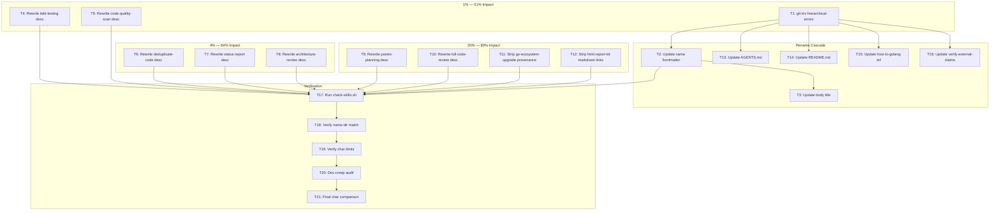

# Plan: Superb Skill Names & Descriptions

> **Created:** 2026-08-02 03:11
> **Scope:** Audit and fix all 24 skill names and descriptions for maximum trigger accuracy and discoverability.

---

## Problem Statement

Not all skills have superb names and descriptions. The skill `description` field is a **trigger, not documentation** — it determines whether Crush invokes the skill. Thin descriptions (under 300 chars) leave 70%+ of the triggering budget unused. One name (`hierarchical-errors`) describes a possibly-nonexistent linter CLI rather than the domain it covers.

### Audit Results

| Metric                                                                | Count                     |
| --------------------------------------------------------------------- | ------------------------- |
| Total skills audited                                                  | 24                        |
| Broken name                                                           | 1 (`hierarchical-errors`) |
| Tier 1 weak descriptions (<300 chars, thin triggers)                  | 5                         |
| Tier 2 decent but improvable (documentation creep, missing phrasings) | 4                         |
| Already excellent (no changes needed)                                 | 14                        |

---

## Pareto Breakdown

### 1% that delivers 51%

| #   | Task                                                    | Why                                                                                                                            |
| --- | ------------------------------------------------------- | ------------------------------------------------------------------------------------------------------------------------------ |
| 1   | Rename `hierarchical-errors` → `go-error-modernization` | The ONLY broken name. Every other skill is named after its domain; this one is named after a tool that may not exist publicly. |
| 2   | Rewrite `bdd-testing` description (210 chars)           | Thinnest description in the repo. Only 4 trigger phrases.                                                                      |
| 3   | Rewrite `code-quality-scan` description (210 chars)     | Tied for thinnest. Missing "lint", "static analysis", "code smells".                                                           |

### 4% that delivers 64%

| #   | Task                                                  | Why                                                          |
| --- | ----------------------------------------------------- | ------------------------------------------------------------ |
| 4   | Rewrite `deduplicate-code` description (232 chars)    | Missing "DRY", "find duplicates", "copy-paste code".         |
| 5   | Rewrite `status-report` description (269 chars)       | Missing "project status", "where are we", "project health".  |
| 6   | Rewrite `architecture-review` description (270 chars) | Repeats skill name as trigger. Missing "architecture audit". |

### 20% that delivers 80%

| #   | Task                                                     | Why                                                                         |
| --- | -------------------------------------------------------- | --------------------------------------------------------------------------- |
| 7   | Rewrite `pareto-planning` description (314 chars)        | Missing "prioritize", "what should I work on first". Ends with impl detail. |
| 8   | Rewrite `full-code-review` description (412 chars)       | Last 2 sentences describe contents, not triggers.                           |
| 9   | Strip provenance from `go-ecosystem-upgrade` (966 chars) | "Built from 14 status reports" is not a trigger.                            |
| 10  | Strip markdown links from `html-report-kit` (627 chars)  | Raw links don't render in skill-selection context.                          |

### The other 20% (polish to 100%)

| #   | Task                                     | Why                                                         |
| --- | ---------------------------------------- | ----------------------------------------------------------- |
| 11  | Update all cross-references after rename | AGENTS.md, README.md, how-to-golang, verify-external-claims |
| 12  | Run `scripts/check-skills.sh`            | Verify no structural regressions                            |
| 13  | Verify all names match directories       | Programmatic check                                          |
| 14  | Verify all descriptions < 1024 chars     | Programmatic check                                          |
| 15  | Final documentation-creep audit          | No rewritten description describes contents                 |

---

## Medium-Granularity Plan (30-100min tasks)

Sorted by impact/effort/customer-value.

| #   | Task                                                                                                                          | Impact   | Effort | Est   | Depends On |
| --- | ----------------------------------------------------------------------------------------------------------------------------- | -------- | ------ | ----- | ---------- |
| M1  | Rename `hierarchical-errors` → `go-error-modernization` + all cross-references                                                | Critical | Medium | 45min | —          |
| M2  | Rewrite Tier-1 descriptions (5 weakest: bdd-testing, code-quality-scan, deduplicate-code, status-report, architecture-review) | Critical | Low    | 40min | —          |
| M3  | Rewrite Tier-2 descriptions (pareto-planning, full-code-review, go-ecosystem-upgrade, html-report-kit)                        | Medium   | Low    | 30min | —          |
| M4  | Full verification pass — check-skills.sh, name-dir matching, char counts, documentation-creep audit                           | High     | Low    | 30min | M1, M2, M3 |

---

## Fine-Grained Breakdown (max 12min per task)

Sorted by impact/effort/customer-value. All tasks are independent unless noted.

| #   | Task                                                                                                        | Impact   | Effort  | Est  | Depends On |
| --- | ----------------------------------------------------------------------------------------------------------- | -------- | ------- | ---- | ---------- |
| T1  | `git mv hierarchical-errors go-error-modernization`                                                         | Critical | Trivial | 2min | —          |
| T2  | Update `name:` frontmatter in go-error-modernization/SKILL.md                                               | Critical | Trivial | 2min | T1         |
| T3  | Update body title `# hierarchical-errors workflow` → `# Go Error Modernization`                             | High     | Trivial | 2min | T1         |
| T4  | Rewrite `bdd-testing` description — add behavior tests, Gomega, Describe/It, spec suite triggers            | Critical | Low     | 5min | —          |
| T5  | Rewrite `code-quality-scan` description — add lint, static analysis, code smells, technical debt triggers   | Critical | Low     | 5min | —          |
| T6  | Rewrite `deduplicate-code` description — add DRY, find duplicates, copy-paste, clones triggers              | High     | Low     | 5min | —          |
| T7  | Rewrite `status-report` description — add project status, where are we, project health triggers             | High     | Low     | 5min | —          |
| T8  | Rewrite `architecture-review` description — stop repeating name, add architecture audit, coupling triggers  | High     | Low     | 5min | —          |
| T9  | Rewrite `pareto-planning` description — add prioritize, what should I work on, impact analysis triggers     | Medium   | Low     | 5min | —          |
| T10 | Rewrite `full-code-review` description — strip contents-as-trigger, add audit my code, deep review triggers | Medium   | Low     | 5min | —          |
| T11 | Strip provenance ("Built from 14 status reports") from `go-ecosystem-upgrade` description                   | Low      | Trivial | 3min | —          |
| T12 | Strip markdown links from `html-report-kit` description                                                     | Low      | Trivial | 3min | —          |
| T13 | Update AGENTS.md §10 external deps table — rename row                                                       | High     | Low     | 5min | T1         |
| T14 | Update README.md skills table entry for renamed skill                                                       | High     | Low     | 5min | T1         |
| T15 | Update how-to-golang/references/key-patterns.md cross-reference link                                        | Medium   | Trivial | 3min | T1         |
| T16 | Update verify-external-claims/SKILL.md verification table entry                                             | Medium   | Trivial | 3min | T1         |
| T17 | Run `scripts/check-skills.sh` — verify no regressions                                                       | High     | Trivial | 3min | T1-T16     |
| T18 | Verify all names match directories programmatically                                                         | High     | Trivial | 3min | T1-T16     |
| T19 | Verify all descriptions < 1024 chars programmatically                                                       | High     | Trivial | 3min | T4-T12     |
| T20 | Documentation-creep audit — verify no rewritten description describes contents                              | Medium   | Low     | 5min | T4-T12     |
| T21 | Re-run char-count comparison — verify improvements                                                          | Medium   | Trivial | 3min | T4-T12     |

---

## Execution Graph

---

## Anti-Verschlimmbesser Safeguards

1. **`git mv` preserves history** — no `cp` + `rm`
2. **Skill body keeps `hierarchical-errors` as CLI name** — the skill name and CLI name are different concepts; the body's verification-status block already explains the CLI may not exist
3. **`docs/status/*` and `docs/feedback/*` are FROZEN** — never updated to reflect the rename; they are historical snapshots
4. **Tags include `hierarchical-errors`** — searchability preserved for users who know the old name
5. **Each description rewrite is additive** — never remove existing trigger phrases, only add missing ones and strip non-trigger content
6. **All rewrites stay under 1024 chars** — verified programmatically after each change
7. **No description describes skill contents** — every sentence is a trigger condition, not documentation

---

## Resolution (2026-08-04)

All 21 tasks (T1–T21) completed in the 2026-08-02 session. The rename
(`hierarchical-errors` → `go-error-modernization`), all 9 description rewrites,
and all cross-reference updates shipped in commits `3a7cc56` and `005f511`. See
`CHANGELOG.md` "2026-08-02" milestone. Forward-looking follow-up items (trigger
collision analysis, verify-before-filing audit) are tracked in `TODO_LIST.md`
(T1–T3).
